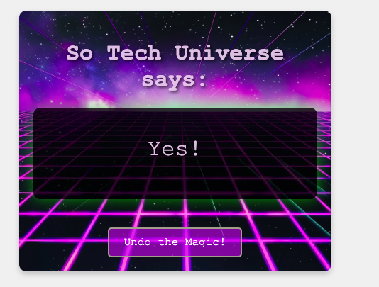

# Magic Ball Project

This is a simple web-based "Magic Ball" application that helps users make decisions by providing a random "Yes" or "No" response. The project is built using HTML, CSS, and JavaScript, with a feature for audio playback.

The main goal of creating this project was to practice using the `main` function and `Math.floor()` statement for generating random responses.

### Main Function in this Project

```javascript
function main() {
  setupAudio();
  setupStartButton();
  setupAskAwayButton();
  setupUndoButton();
}
```

### Preview of the Web Page:



This is an open-source project, and I invite everyone to participate in its development and improvement!
